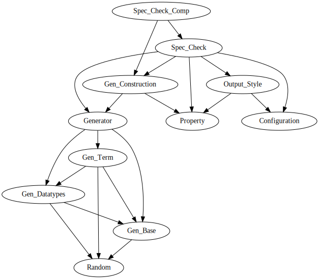

This is a Quickcheck tool for Isabelle/ML.

## Authors
- Lukas Bulwahn
- Nicolai Schaffroth
- Sebastian Willenbrink

## Quick Usage
Preferred usage:
- Import Spec_Check.thy into your environment
- Write specifications using the ML invocation: "checkGen ctxt (gen, printer) (name, prop)" where
  * ctxt is the desired context
  * gen is the random value generator used for the test. See generator.ML
  * printer converts values into strings to show the failing inputs
  * name is the shown name of the test
  * prop is the property to be tested. See property.ML

Examples can be found in tester.ML and test.thy here: https://gitlab.lrz.de/ga85wir/bachelorthesis/-/blob/master/src/tester.ML
  

Alternative usage which does not require explicit generators but prevents typechecking and referring to code defined outside of the test:
- Import Spec_Check.thy in your development
- write specifications with the ML invocation: `check_property "ALL x. P x"` where `P x` is ML code evaluating to a boolean

Examples can be found in Examples.thy
      
## Dependency Graph      

Update graphic with: "dot -Tsvg dependencies.dot -o dependencies.svg"

## Notes

Our specification-based testing tool originated from Christopher League's
QCheck tool for SML (cf. https://github.com/league/qcheck). As Isabelle
provides a rich and uniform ML platform (called Isabelle/ML), this
testing tools is very different than the one for a typical ML developer.

1. Isabelle/ML provides common data structures, which we can use in the
tool's implementation for storing data and printing output.

2. The implementation in Isabelle that will be checked with this tool
commonly use Isabelle/ML's int type (which corresponds ML's IntInf.int),
but they do not use other integer types in ML, such as ML's Int.int,
Word.word and others.

3. As Isabelle can run heavily in parallel, we avoid reference types.

4. Isabelle has special naming conventions and documentation of source
code is only minimal to avoid parroting.

## Next steps:
  - Remove all references and store the neccessary random seed in the
    Isabelle's context.
  - Simplify some existing random generators.
    The original ones from Christopher League are so complicated to
    support many integer types uniformly.

## License

  The source code originated from Christopher League's QCheck, which is
  licensed under the 2-clause BSD license. The current source code is
  licensed under the compatible 3-clause BSD license of Isabelle.

